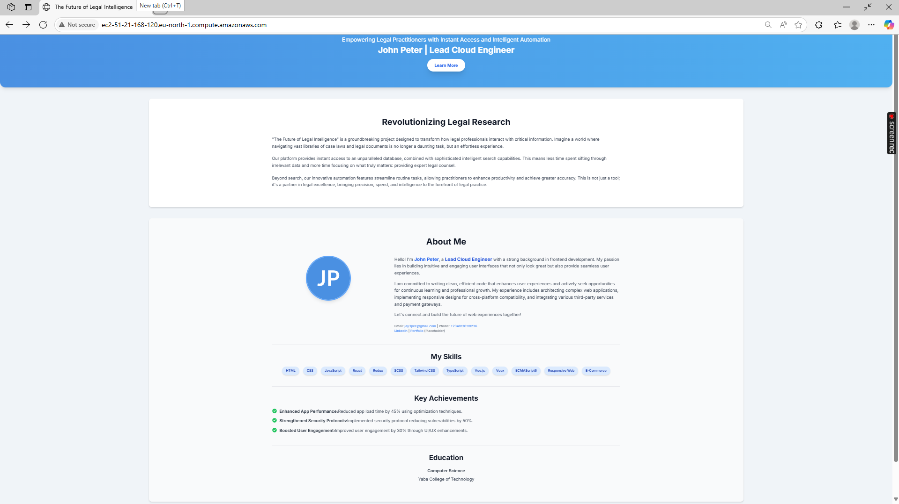

# Dynamic Landing Page Deployment

## 📌 Project Overview

Prototype landing page showcasing **"The Future of Document Search for Legal Practitioners"**.

Goal: Demonstrate cloud provisioning and web deployment skills.

---

## 🖥️ Server Provisioning

- **Cloud Provider:** AWS EC2
- **Instance Type:** `t3.micro` (Free Tier)
- **Operating System:** Ubuntu 22.04 LTS

### Steps:

```bash
# Connect to instance
ssh -i <key-file.pem> ubuntu@<ec2-public-ip>
```

---

## 🌐 Web Server Setup

- **Web Server:** Nginx
- **Application Server:** Node.js (Express)
- **Process Manager:** PM2

### Install Dependencies:

```bash
sudo apt update
sudo apt install nginx nodejs npm -y
npm install express
npm install -g pm2
```

### 📂 Project Files

- `server.js`: Node.js Express server to serve static files.
- `public/index.html`: Main landing page HTML file.

Ensure both files are in the `~/bio-landing` directory as shown below.

---

## ⚙️ Application Setup

### Directory Structure:

```plaintext
~/bio-landing
├── server.js       # Node.js server
└── public/
    └── index.html  # Landing page using Tailwind CDN
```

### Example `server.js`:

```js
const express = require("express");
const app = express();
const PORT = 4000;

app.use(express.static("public"));

app.listen(PORT, () => {
  console.log(`Server running on port ${PORT}`);
});
```

### Start Server with PM2:

```bash
pm2 start server.js
pm2 save
pm2 startup
```

---

## 🔁 Nginx Reverse Proxy Configuration

### Create Config File:

```bash
sudo nano /etc/nginx/sites-available/bio-landing
```

### Example Config:

```nginx
server {
    listen 80;
    server_name <your-ec2-public-ip-or-domain>;

    location / {
        proxy_pass http://localhost:4000;
        proxy_http_version 1.1;
        proxy_set_header Upgrade $http_upgrade;
        proxy_set_header Connection 'upgrade';
        proxy_set_header Host $host;
        proxy_cache_bypass $http_upgrade;
    }
}
```

### Enable Site & Restart NGINX:

```bash
sudo ln -s /etc/nginx/sites-available/bio-landing /etc/nginx/sites-enabled/
# To avoid displaying NGINX welcome page
sudo rm /etc/nginx/sites-available/default
sudo nginx -t
sudo systemctl reload nginx
```

---

## 🔐 Networking & Security

**Security Group Configuration:**

- **Allowed Ports:** `22 (SSH)`, `80 (HTTP)`, `443 (HTTPS)`
- **Inbound Rules:**
  - **HTTPS (TCP/443):** `0.0.0.0/0`
  - **SSH (TCP/22):** `0.0.0.0/0`
  - **HTTP (TCP/80):** `0.0.0.0/0`

---

## 🚀 Deployment URL

[http://ec2-51-21-168-120.eu-north-1.compute.amazonaws.com/](http://ec2-51-21-168-120.eu-north-1.compute.amazonaws.com/)

---

## 🖼️ Landing Page Preview



## ❗ SSL Status

SSL setup **attempted but skipped** due to issues with free domain registrars requiring suspicious payments.

Focus was placed on ensuring **HTTP** accessibility for project completion.

---

## 👤 Author Information

**John Peter**  
Frontend Developer | Aspiring Cloud Engineer

---
